# 个人博客说明文档


## 一、首页预览


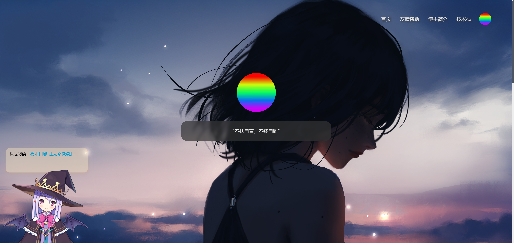


#### 网站的顶部是一个导航栏，导航栏当中又五个部分，前四个部分为“首页”、“友情赞助”、“博主简介”、“技术栈”，对应四个页面，第五个部分为个人头像

#### 导航栏，当鼠标移到文字上时，文字下方会有反馈动画，这里利用伪元素实现

```
/* 创建底部边框 */
.nav-son::before {
	content: "";
	position: absolute;
	bottom: -3px; /* 将伪元素定位到导航栏项的底部 */
	left: 0;
	width: 100%;
	height: 4px; /* 边框高度 */
	border-radius: 15px;
	background-color: rgb(0, 125, 255);
	transform: scaleX(0); /* 初始状态下将宽度缩放为0，隐藏边框 */
	transform-origin: left center; /* 设置变换原点为左侧中心 */
	transition: transform 0.3s; /* 设置过渡属性和过渡时间 */
}
```

#### 当鼠标挪入导航栏区域，导航栏背景会变为灰色

#### 中间为个人头像的大图，头像下方为座右铭

#### 座右铭的背景使用高斯模糊，模糊半径为5px

```
backdrop-filter: blur(5px); /* 添加高斯模糊效果 */
```


#### 所有页面的左下角，都嵌入了一个live-2d看板娘

#### 这里使用开源项目https://github.com/stevenjoezhang/live2d-widget

```
<script src="js/live2d-widget-master/autoload.js""></script>
```


#### 所有页面的滚动条样式均作修改

```
::-webkit-scrollbar {
    width: 6px;
    height: 6px;
}

::-webkit-scrollbar-thumb {
    background-color: #4B5563;
    border-radius: 25px;
}

::-webkit-scrollbar-track, body.dark::-webkit-scrollbar-thumb {
    background-color: #eee;
}
```


#### 当向下滚动时，导航栏会发生变化

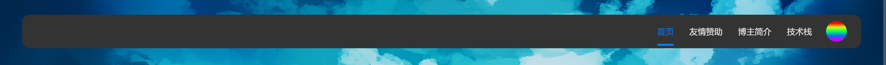

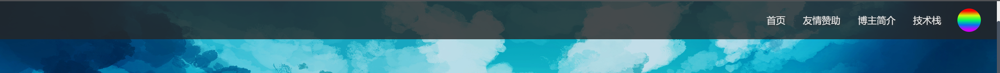

滚动回去则会变回原样，这里利用js实现

```
// 导航栏js
var nav = document.querySelector('.nav');
window.addEventListener('scroll', function() {
  var scrollTop = window.pageYOffset || document.documentElement.scrollTop;

  if (scrollTop > 0) {
    // 滚动条不在顶部时的样式
    nav.style.width = '100%';
    nav.style.borderRadius = '0';
    nav.style.top = '0px';
    nav.style.backgroundColor = 'rgba(38, 38, 38, 0.8)';
    nav.style.transition = 'all 1s'; // 添加过渡效果

    // 鼠标悬停时的样式
    nav.addEventListener('mouseover', function() {
      nav.style.backgroundColor = 'rgba(51, 51, 51, 0.8)';
    });

    nav.addEventListener('mouseout', function() {
      nav.style.backgroundColor = 'rgba(51, 51, 51, 0.8)';
    });
  } else {
    // 滚动条在顶部时的样式
    nav.style.width = '95%';
    nav.style.borderRadius = '15px';
    nav.style.top = '30px';
    nav.style.backgroundColor = 'rgba(51, 51, 51, 0)';
    nav.style.transition = 'all 1s'; // 添加过渡效果

    // 鼠标悬停时的样式
    nav.addEventListener('mouseover', function() {
      nav.style.backgroundColor = 'rgba(51, 51, 51, 1)';
    });

    nav.addEventListener('mouseout', function() {
      nav.style.backgroundColor = 'rgba(51, 51, 51, 0)';
    });
  }
});


```


#### 每次刷新页面时，首页所有图片顺序全部随机加载

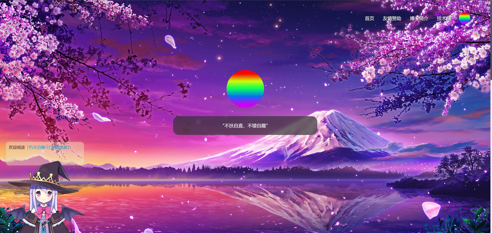

#### 实现原理：根据图片数量，随机生成路径

```
window.addEventListener('load', function() {
  var backgroundCount = 31; // 背景图像的总数
  var displayPics = document.querySelectorAll('.display-pic'); // 获取所有 display-pic 元素

  // 遍历每个 display-pic 元素
  displayPics.forEach(function(displayPic) {
    var randomIndex = Math.floor(Math.random() * backgroundCount) + 1; // 生成 1 到 backgroundCount 的随机整数
    displayPic.src = './img/background' + randomIndex + '.jpg'; // 设置当前 display-pic 元素的图片路径
  });
});
```

#### 首页底部为文章部分，当鼠标放到文章区域，会有阴影特效，当鼠标放到图片上，图片会有微放大的过渡动画，均利用css实现

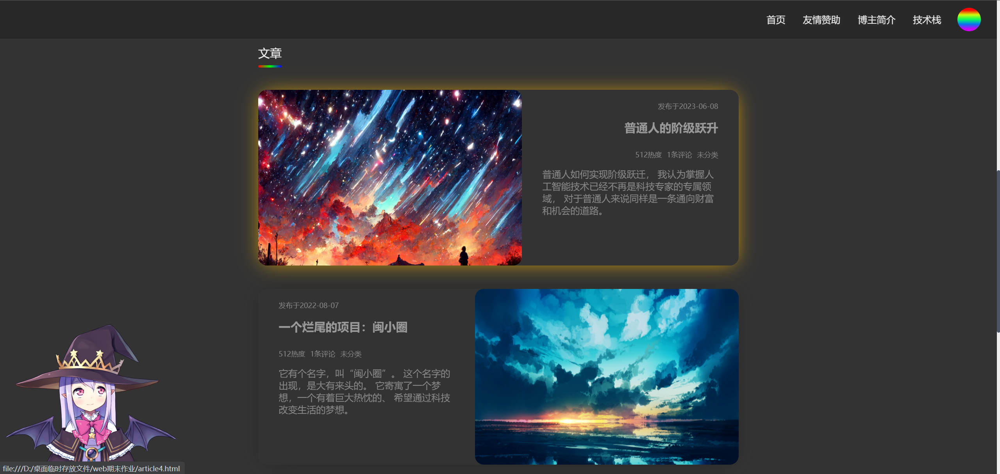


#### 所有文章，图片和文字的左右顺序均由js控制，从上往下，单数篇文章，图片居左，文字居右，偶数篇文章，图片居右，文字居左

#### 实现原理如下：

#### 提前在css预定义左右浮动

```
/* 左浮动 */
.left {
	float: left;
	}
/* 右浮动 */
.right {
	float: right;
	}
```

然后用js遍历单数和偶数，并添加浮动方向的类名

```
window.addEventListener('load', function() {
    var exhibits = document.querySelectorAll('.exhibit');
    var introduce = document.querySelectorAll('.introduce');
	var date = document.querySelectorAll('.date');
	var contentTitle = document.querySelectorAll('.content-title');
    var postMeta = document.querySelectorAll('.post-meta');
	var postMain = document.querySelectorAll('.post-main');
	for (var i = 0; i < exhibits.length; i++) {
      if (i % 2 === 0) {
        exhibits[i].classList.add('left');
		introduce[i].classList.add('right');
		date[i].classList.add('right');
		contentTitle[i].classList.add('right');
		postMeta[i].classList.add('right');
		postMain[i].classList.add('right');
      } else {
        exhibits[i].classList.add('right');
		introduce[i].classList.add('left');
		date[i].classList.add('left');
		contentTitle[i].classList.add('left');
		postMeta[i].classList.add('left');
		postMain[i].classList.add('left');
      }
    }
	
  });
```


## 二、文章页面

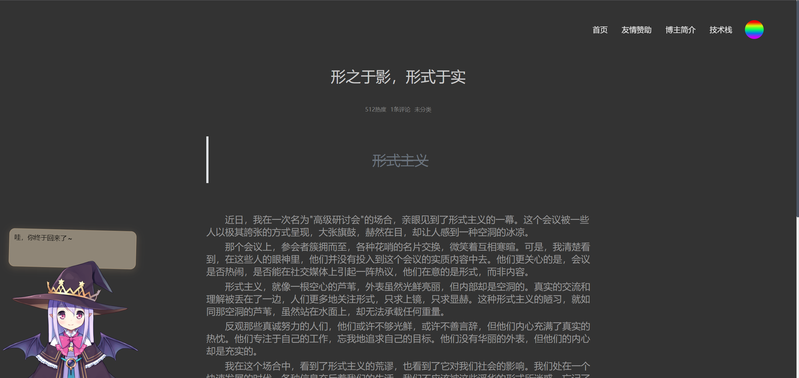


#### 文章页面由标题、文章信息、题记、文章内容，以及评论构成，部分区域有css动画


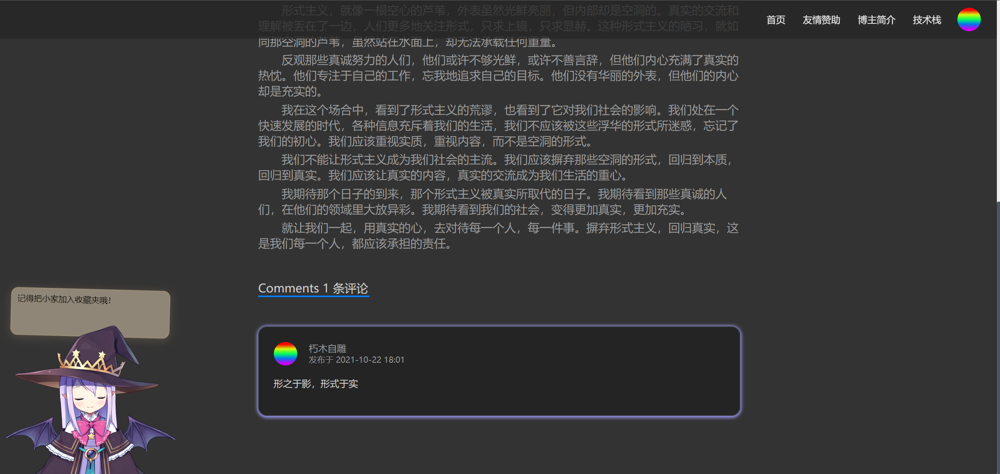


#### 所有文章在每次刷新页面时，标题从上方缓缓落下，文章从下面缓缓上升，并且有透明到显现的过渡

#### 实现原理如下

```
window.addEventListener('load', function() {
  var articleTitle = document.querySelector('.article-title');
  var main = document.querySelector('.main');
  articleTitle.style.opacity = '0'; // 初始状态设置为透明
  main.style.opacity = '0'; 
  articleTitle.style.transform = 'translateY(-100%)'; // 初始状态设置为位于上方
  main.style.transform = 'translateY(100%)';// 初始状态设置为位于下方

  setTimeout(function() {
   articleTitle.style.transition = 'opacity 1.5s ease-in-out, transform 1s ease-in-out'; // 添加过渡效果
   articleTitle.style.opacity = '1'; // 设置结束状态为完全显现
   articleTitle.style.transform = 'translateY(0)'; // 设置结束状态为位于原始位置
	main.style.transition = 'opacity 2s ease-in-out, transform 1.5s ease-in-out'; // 添加过渡效果
	main.style.opacity = '1'; // 设置结束状态为完全显现
	main.style.transform = 'translateY(0)'; // 设置结束状态为位于原始位置
  }, 100);
});

```


## 三、博主简介页面


#### 通过cdn引用three.js等第三方库

```
<script src="https://cdnjs.cloudflare.com/ajax/libs/three.js/r75/three.min.js"></script>
<script src="https://cdnjs.cloudflare.com/ajax/libs/gsap/1.18.0/TweenMax.min.js"></script>
<script src="https://s3-us-west-2.amazonaws.com/s.cdpn.io/175711/bas.js"></script>
```

#### 实现粒子动画效果，并可通过鼠标拖动控制进度

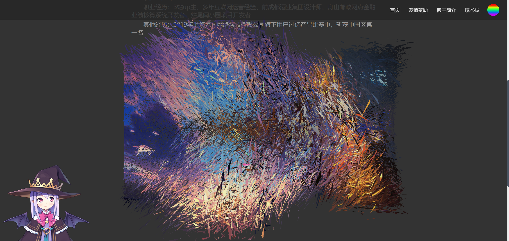


## 四、技术栈

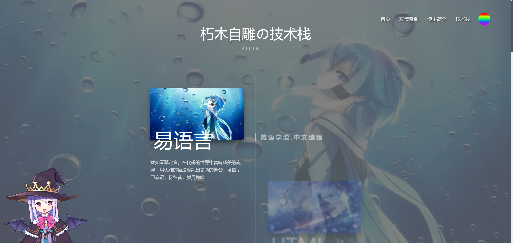


#### 中间有一时间轴（通过伪元素实现）

```
.shell:before {
	position: absolute;
	left: 0;
	top: 0;
	width: 100%;
	height: 100%;
	background: rgba(99, 99, 99, 0.8);
	content: "";
}
```

#### 鼠标向下滚动，当鼠标滚动时，触发滚动事件，并且检测滚动距离，获取当前时间轴项目的最小和最大高度，如果当前滚动位置在当前项目的最小和最大高度之间，则将当前项目设置为激活状态，并设置背景图片为当前项目的图片，如果滚动到最后一个项目，并且超过了当前项目高度的一半，则将最后一个项目设置为激活状态，并设置背景图片为最后一个项目的图片。

#### 实现原理如下：

```
(function () {
    var timeline = function (id) {
        var selectors = {
            id: document.querySelector(id),
            item: document.querySelectorAll(id + " .item"),
            activeClass: "item--active",
            img: ".img"
        };
        
        // 将第一个时间轴项目激活，并设置时间轴背景图片为第一个项目的图片
        selectors.item[0].classList.add(selectors.activeClass);
        selectors.id.style.backgroundImage = 'url(' + selectors.item[0].querySelector(selectors.img).src + ')';
        
        // 获取时间轴项目的总数
        var itemLength = selectors.item.length;

        // 当页面滚动时，触发滚动事件
        window.onscroll = function () {
            var max, min;
            // 获取页面滚动的距离
            var pos = window.pageYOffset;
            Array.prototype.forEach.call(selectors.item, function (element, i) {
                // 获取当前时间轴项目的最小和最大高度
                min = element.offsetTop;
                max = element.offsetHeight + element.offsetTop;
                
                // 如果滚动到最后一个项目，并且超过了当前项目高度的一半，
                // 则将最后一个项目设置为激活状态，并设置背景图片为最后一个项目的图片
                if (i == itemLength - 2 && pos > min + element.offsetHeight / 2) {
                    Array.prototype.forEach.call(selectors.item, function (element) {
                        element.classList.remove(selectors.activeClass);
                    });
                    selectors.id.style.backgroundImage = 'url(' + selectors.item[itemLength - 1].querySelector(selectors.img).src + ')';
                    selectors.item[itemLength - 1].classList.add(selectors.activeClass);
                }
                // 如果当前滚动位置在当前项目的最小和最大高度之间，
                // 则将当前项目设置为激活状态，并设置背景图片为当前项目的图片
                else if (pos <= max - 10 && pos >= min) {
                    selectors.id.style.backgroundImage = 'url(' + element.querySelector(selectors.img).src + ')';
                    Array.prototype.forEach.call(selectors.item, function (element) {
                        element.classList.remove(selectors.activeClass);
                    });
                    element.classList.add(selectors.activeClass);
                }
            });
        };
    };
    timeline("#shell");
})();

```


## 五、所有页面响应式

#### 所有页面均用css做响应式处理


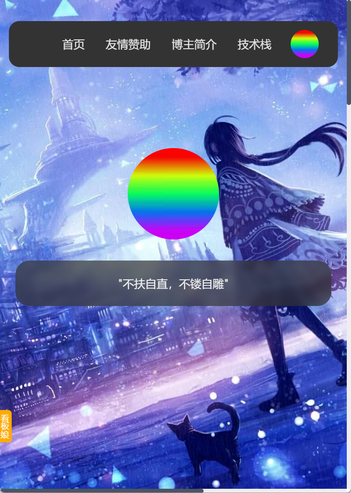

```
@media only screen and (max-width: 820px) {
	.bottom{
		width: 450px;
	}
	.article{
		width: 450px;
		height: 560px;
		margin: 30px auto;
	}
	
	.article::after{
		content: "";
		display: block;
		clear: both;
	}
	
	.content{
		width: 450px;
	}
	
	.introduce{
		width: 450px;
		height: 270px;
		
	}
	


}
```


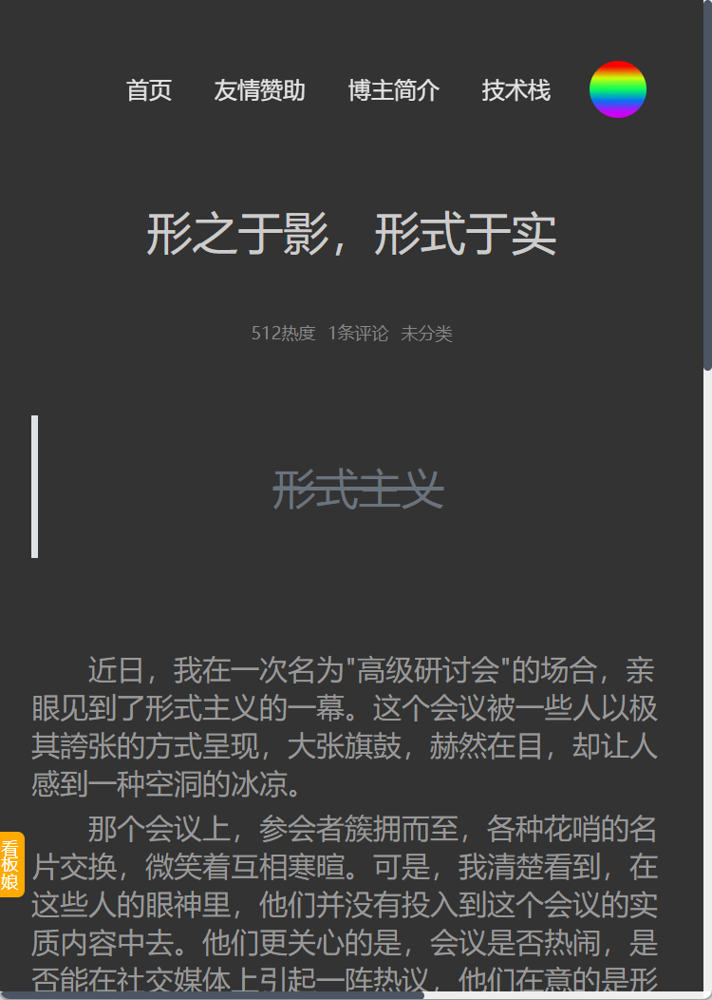

```
@media only screen and (max-width: 820px) {
	.bottom,.title,.inscription{
		width: 450px;
	}
	
	img{
		width: 450px !important;
	}
	
	.comment{
		width: 400px;
	}

}
```


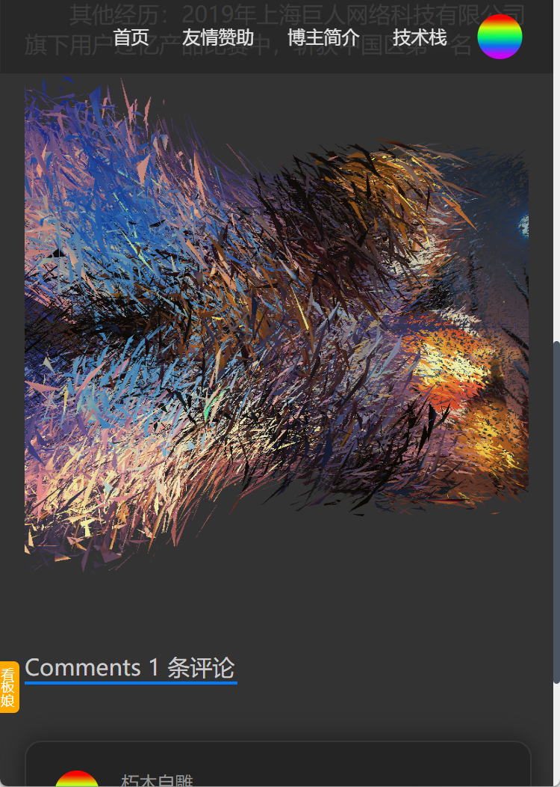

```
@media only screen and (max-width: 820px) {
	canvas:nth-child(1){
		margin-top: 0px;
		width: 450px !important;
		height: 470px !important;
		left: 0%;
	}
}
```


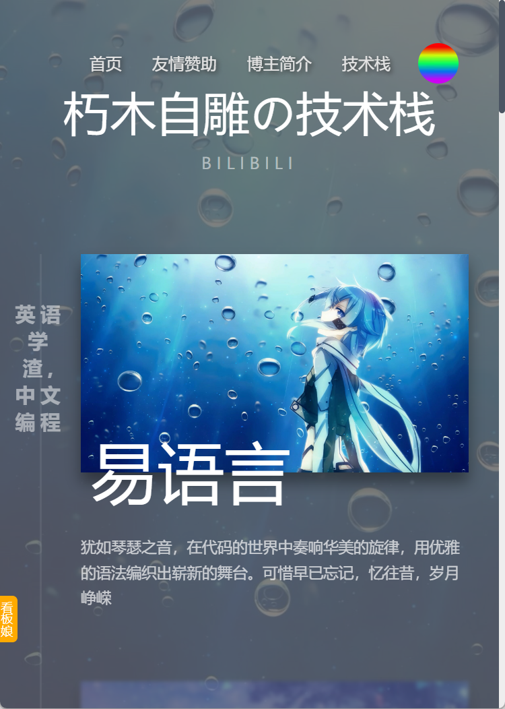

```
@media only screen and (max-width: 820px) {
	.item {
		align-self: baseline !important;
		width: 100%;
		padding: 0 30px 150px 80px;
	}

	.item:before {
		left: 10px !important;
		padding: 0 !important;
		top: 50px;
		text-align: center !important;
		width: 60px;
		border: none !important;
	}

	.item:last-child {
		padding-bottom: 40px;
	}
}

@media only screen and (max-width: 820px) {
	.timeline:before {
		left: 40px;
	}
}
```


## 六、黑夜白天切换开关

#### 右下角加入白天黑夜切换开关


#### 白天

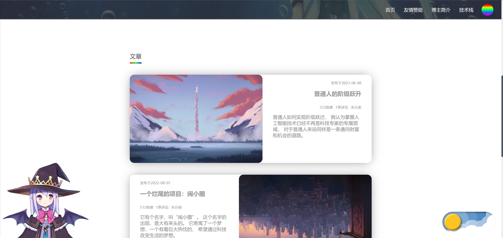


#### 黑夜

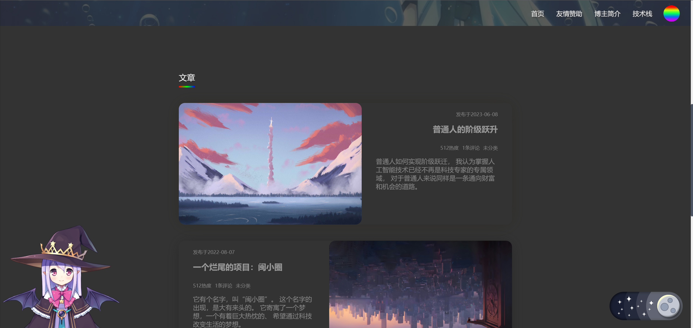


#### 开关具体外观如下

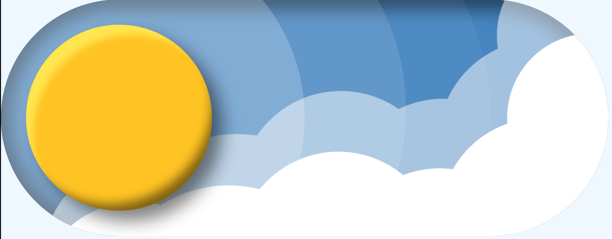

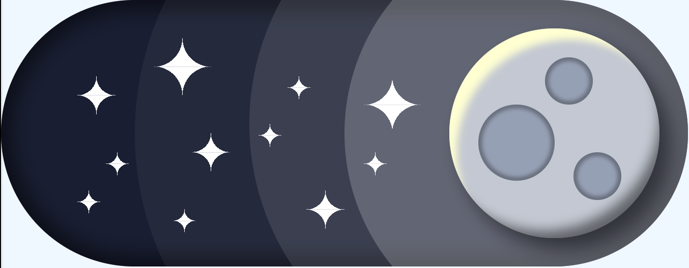

#### 并且点击时，有css过渡动画，太阳缓缓移动到右侧，渐变颜色，变为月亮，同时云朵下移，星星落下，反之亦然

#### HTML部分包括主体按钮，光晕，云层，陨石坑，星星几个部分，代码如下

```
<div class="components">
			<div class="main-button">
				<div class="moon"></div>
				<div class="moon"></div>
				<div class="moon"></div>
			</div>
			<div class="daytime-backgrond"></div>
			<div class="daytime-backgrond"></div>
			<div class="daytime-backgrond"></div>
			<div class="cloud">
				<div class="cloud-son"></div>
				<div class="cloud-son"></div>
				<div class="cloud-son"></div>
				<div class="cloud-son"></div>
				<div class="cloud-son"></div>
				<div class="cloud-son"></div>
			</div>
			<div class="cloud-light">
				<div class="cloud-son"></div>
				<div class="cloud-son"></div>
				<div class="cloud-son"></div>
				<div class="cloud-son"></div>
				<div class="cloud-son"></div>
				<div class="cloud-son"></div>
			</div>
			<div class="stars">
				<div class="star big">
					<div class="star-son"></div>
					<div class="star-son"></div>
					<div class="star-son"></div>
					<div class="star-son"></div>
				</div>
				<div class="star big">
					<div class="star-son"></div>
					<div class="star-son"></div>
					<div class="star-son"></div>
					<div class="star-son"></div>
				</div>
				<div class="star medium">
					<div class="star-son"></div>
					<div class="star-son"></div>
					<div class="star-son"></div>
					<div class="star-son"></div>
				</div>
				<div class="star medium">
					<div class="star-son"></div>
					<div class="star-son"></div>
					<div class="star-son"></div>
					<div class="star-son"></div>
				</div>
				<div class="star medium">
					<div class="star-son"></div>
					<div class="star-son"></div>
					<div class="star-son"></div>
					<div class="star-son"></div>
				</div>
				<div class="star small">
					<div class="star-son"></div>
					<div class="star-son"></div>
					<div class="star-son"></div>
					<div class="star-son"></div>
				</div>
				<div class="star small">
					<div class="star-son"></div>
					<div class="star-son"></div>
					<div class="star-son"></div>
					<div class="star-son"></div>
				</div>
				<div class="star small">
					<div class="star-son"></div>
					<div class="star-son"></div>
					<div class="star-son"></div>
					<div class="star-son"></div>
				</div>
				<div class="star small">
					<div class="star-son"></div>
					<div class="star-son"></div>
					<div class="star-son"></div>
					<div class="star-son"></div>
				</div>
				<div class="star small">
					<div class="star-son"></div>
					<div class="star-son"></div>
					<div class="star-son"></div>
					<div class="star-son"></div>
				</div>
				<div class="star small">
					<div class="star-son"></div>
					<div class="star-son"></div>
					<div class="star-son"></div>
					<div class="star-son"></div>
				</div>
			</div>
		</div>
```

#### 星星部分采用四个div合并的方式组成，css如下

```
.star-son{
	float: left;
}

/* 大星星 */
.big .star-son:nth-child(1){
	width: 7.5px;
	height: 7.5px;
	background-image: radial-gradient(circle 7.5px at left 0, transparent 7.5px, #fff);
}

.big .star-son:nth-child(2){
	width: 7.5px;
	height: 7.5px;
	background-image: radial-gradient(circle 7.5px at right 0, transparent 7.5px, #fff);
}

.big .star-son:nth-child(3){
	width: 7.5px;
	height: 7.5px;
	background-image: radial-gradient(circle 7.5px at 0 bottom, transparent 7.5px, #fff);
}

.big .star-son:nth-child(4){
	width: 7.5px;
	height: 7.5px;
	background-image: radial-gradient(circle 7.5px at right bottom, transparent 7.5px, #fff);
}
```


#### 部分过渡采用贝塞尔曲线实现非线性动画

```
transition: 0.7s;
transition-timing-function: cubic-bezier( 0,0.5, 1.3,1);
```


## 七、项目已上传至Github

#### https://github.com/Xiumuzaidiao/web-blog
